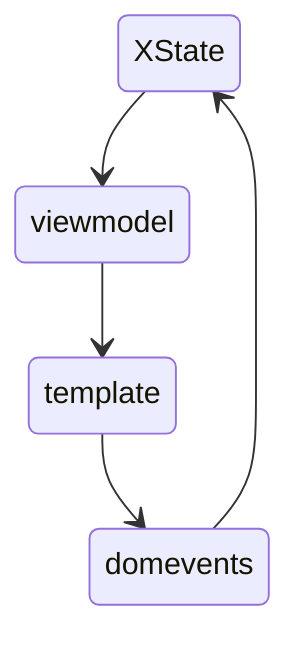
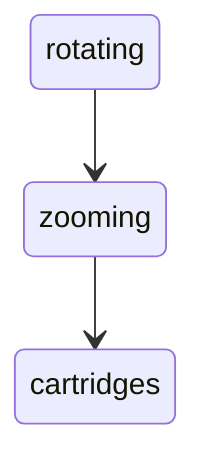

# NissyGirl - The Web Based Handheld Console

[Live Demo](https://tanishalfelven.github.io/nissy-girl/)


NissyGirl is a 3D handheld game console that is rendered with CSS/HTML and powered by Svelte/XState/Vite/m-css - What you are seeing is all HTML and CSS. The appearance of the NissyGirl is achieved through perspective tricks and usage of `translateZ()`.

**There is NO `Three.js` or 3D rendered scene to make this work, primarily a pile of `<div>s`.**

The NissyGirl is lovingly designed to be touch interactive first (with keyboard and mouse interactions also supported). The philosophy behind this decision hails back to the nostalgia felt when finding an old handheld console of a past age, flipping it over to inspect the cartridge, and turning it on to see what hides inside. Now you can enjoy a similar but new experience from your web browser.

At the time of this writing the NissyGirl as a platform supports many types of cartridges though only the Paint cartridge is implemented.

## Architecture

The structure of the NissyGirl mirrors how one might think of the systems that naturally interact.

To achieve this, state is modeled in XState, changes are communicated to view models, which update Svelte 5 runes, which update the template. Pointer events are generated from template event listeners which feed back into the machine.



## Building the NissyGirl

The trick for 3D CSS relies on the `perspective` style directive and `translateZ`. Below are videos that help illustrate how this works: it's all HTML/CSS, with no source model or 3D rendered scene, just a pile of perspective tricks and rotated panels.

| wireframe | perspective | exploded |
| --- | --- | --- |
|  |  |  |

The back panel is loaded with perspective tricks. The edge panels imply curves, the panels on the back imply shape matching the curves. It's really about 3 different layers that meet the sides at just the right place without seams. The result is a couple of flat panels that convincingly read like a 3D game console.


The [NissyGirl machine](/src/nissy-girl/nissy-girl.machine.js) is the root XState machine for the program. It hosts the camera machine at its root and models the device lifecycle.

### Controls

Building a virtual game console is nothing without working controls.


The DPAD rotating on its axis in reaction to pointer movements was really important to get right. Pointer movements translate into game movements through a light touch handler layer wrapped with a Svelte action. Input events from the dpad pointer listeners and keyboard event listeners result in the dpad element rotation through a centralized input middleware.


All controls on the NissyGirl are interactive. The buttons themselves all come from the same Svelte component and share core capability. 

The volume wheel was really fun to build because despite being something like a normal web slider element, it needed to work as an interactive element that was easy to read and fits the pseudo 3D pixel aesthetic. The toothed edge of a wheel is made of two rotating faces that are bridged by a single pixel matching the marker on the faces.


The power switch hosts one of the more complicated CSS/HTML parallax renderings.

## The Camera Flow and Interaction Design


The camera XState machine models the camera states that the user travels through to rotate, zoom, and select and insert or eject cartridges. This is a discrete flow of animation steps with unique interactions at each flow phase.




The intention with camera interactions is to be as discoverable and intuitive as possible. Discovery should be rewarding, and consistent. The design required that any interaction flow could be cancelled or reversed completely.

A generalized [progress](/src/util/progress.svelte.js) rune wrapper is used to solve needing discrete states that power separate interactions. Velocity for interactions in a generalized way without relying on a keyframe library was a must. The progress wrapper creates a convenient velocity target - animation values are then output into `$derived` runes directly where they transform into more meaningful animation values.


To have velocity carry between interaction to interaction, a single velocity source is maintained by a [XState fromCallback actor](/src/util/release-velocity.actor.js). The statechart simply notifies the release actor on state change that the actor needs to target a different progress target.

```js
// camera.machine.js
// at machine root
invoke  : [
	createReleaseVelocity(ROTATE_VELOCITYID, "ROTATE_SWIPE"),
],

// notify actor of new progress target on state change
"zooming"  : {
	entry  : updateVelocityTarget(ROTATE_VELOCITYID, zoom),
``` 


The camera machine became the entry point to cartridge selection. Cartridges need to feel substantial and interesting, getting this reveal animation just right was a lot of fun. The cartridge itself has a surprising amount of faces and may be fun to inspect. 😉


Inserting a cartridge is the first interaction of the camera machine that needed to actually do something to the NissyGirl. Adding another pointer target also introduced new difficulties - so far you could move through and back by swiping horizontally. Watching users interact with NissyGirl showed that they expected to be able to drag the cartridge vertically, so that became a core interaction concept.


And finally, after insertion you can rotate it back and look at it. Any stage in this interaction chain can be bailed out of early - often by swiping the opposite direction of entering.

## Cartridges and games

The NissyGirl cartridges have a really neat advantage due to the NissyGirl device being all HTML/CSS - they can host a canvas inside of them and rely on HTML/CSS for their UI layer. The first NissyGirl cartridge, Paint, was intended to stress test the base concepts to get this working. After a game is loaded and the machine is powered on, a game machine is loaded directly.

The canvas screen is created at program start and the NissyGirl machine waits for it to exist and be wrapped in a light layer on top of a PixiJS renderer - this gives us fine-grained control of the render loop.

### Introducing: the gameloop machine


The [gameloop machine](/src/game/shared/game-loop.machine.js) maintains a lazy RAF loop that can be registered to by scenes, entities/components, and input. The expected flow for a game cartridge is that it points to a game machine. The game machine is invoked dynamically from the nissy-girl machine.

The game machine (below) has the gameloop machine invoked at its root. A scene actor is then invoked which registers itself to the gameloop. Both input and Entities inside of a Scene can request a frame from the gameloop machine. The gameloop machine detects from the scene if a frame is required and only triggers RAF updates when necessary.

### Scene based statechart composition

The cartridge game architecture is loosely based on ECS. Entities exist as part of a scene and are composed of Component interfaces. At invocation of a scene, we compile the ordering of our frame based on a canonical component ordering defined at scene creation time. This means that a frame update can be very dynamically defined (with components providing regular interfaces) that results in a predictable update loop.

The paint game scene invocation looks like the following:

```js
invokeScene({
	id : "artboard",
	world : () => createWorld({
		components : {
			camera : createCamera,
		},
	}),
	entities : [
		createArtboard,
		createCursor,
		createPaintUI,
	],
	componentOrder : [
		"world",
		"movement",
		"camera",
		"tool",
		"ui",
		"render",
	],
}),
```


The [paint game machine](/src/game/paint/paint.machine.js) currently only has drawing with a small submenu flow.

The UI for NissyGirl games are all drawn with Svelte. The web is the best UI framework available, no need to reinvent this through canvas. A scene can communicate directly with Svelte template through entity components. A UI entity sets up a UI component and registers to the `movement` component pattern. Both the in-game cursor entity and the in-game UI entity use the same `movement` contract with different implementations to handle inputs!


UI Navigation is in its early stages but the core concept is that nav items should be placed at regular intervals. Nav items are added through a slim Svelte action. After registration, Svelte actions collaborate with their nav component to arrange in regular rows that rely on some assumptions about left-to-right and y placements. This allows for a very simple navigable context that updates directly to Svelte template UI.


## Future planning

- More cartridges
- Lore
- FTUE and tutorialization
- Accessibility

## License

Unless otherwise noted, all source code in this repository is licensed under
the PolyForm Noncommercial License 1.0.0.
This license applies to all source-code revisions authored by Tanis Newlun in
this repository, including revisions created before the license was added on
August 1, 2026.
Original artwork, visual assets, written content, logos, product names, and
branding may be viewed as part of the project, but are not licensed for reuse,
modification, or redistribution. They remain Copyright © 2026 Tanis Newlun.
All rights reserved.

Commercial use requires a separate written license from Tanis Newlun.
